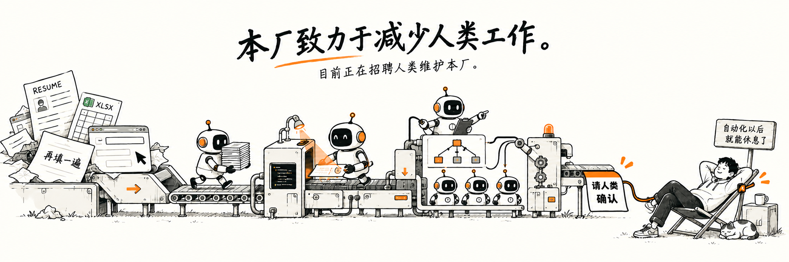

<div align="center">

<samp>HUMAN-IN-THE-LOOP · 人类暂未下线</samp>

# 人类待办消灭计划

**你好，我负责提出需求、写代码，以及怀疑需求。**

把重复劳动交给程序，把不确定性交给 AI。  
最后的确认按钮，留给人类。

[正在造的东西 ↓](#正在造的东西) · [OfferPilot](https://github.com/offercontext/offerPilot) · [OfferContext Hub](https://hub.offercontext.cn)

</div>

---

```text
$ whoami
一个遇到重复操作，会先想「能不能写个工具」的人。

$ cat current-task.txt
原始需求：少填几遍简历。
当前进度：正在维护求职平台、浏览器插件和 AI 工作台。
问题定位：可能对「顺手做一下」的理解存在偏差。
```

## 正在造的东西

### 🛫 OfferPilot · 给求职装一个副驾驶

开源、本地优先的 AI 求职工作台。把投递、简历、模拟面试、复盘和 Offer 对比放到一起，让每次准备都有迹可循。

> 希望 AI 帮我准备面试。它反手给我加了一轮模拟面试。

[查看源码 →](https://github.com/offercontext/offerPilot)

### 🧩 OfferContext · 和重复填表有点私人恩怨

围绕校招机会发现、投递管理、简历智能填表和经验交流，做一套能实际用起来的求职工具。

> 简历已经上传了。为什么还要把简历再填一遍。为什么。

[打开工作台 →](https://hub.offercontext.cn)

## 技术成分表

| 成分 | 主要用途 |
| :--- | :--- |
| Python / FastAPI | 把 AI 能力接进实际工作流 |
| Java / Spring Boot | 让业务逻辑有地方安家 |
| TypeScript / React | 给复杂功能一个能看懂的入口 |
| Agent / Skills / 浏览器插件 | 让「这也要手动？」少出现几次 |
| 人类 | 确认、取舍，以及认领自己写的 bug |

## 一些朴素的执念

- 工具做出来，要真的能用。
- AI 可以提出建议，重要操作要让人看清楚、做决定。
- 自动化省下来的时间，通常会被拿去写更多自动化。

<details>
<summary><b>🧪 点击查看本实验室精神状态</b></summary>

```python
while life.has_repetitive_work():
    tool = build_something()
    life.add(tool.maintenance())
```

**已知问题：** 为了少做一点事，做了很多东西。  
**修复方案：** 再做一个东西。

</details>

---

<div align="center">

<samp>欢迎交流 AI 工具、Agent 工作流，以及那些「这个应该可以自动化吧」的瞬间。</samp>

<sub>本人仍在循环中。请勿断电。</sub>

</div>
